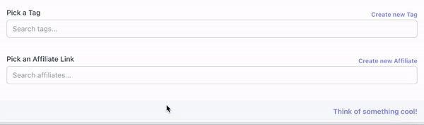

<p align="center">
    <a href="#">
        
    </a>
</p>

<p align="center">
  
</p>

# AlienSelect

AlienSelect is a dynamic Livewire component designed for selecting related models in a flexible and user-friendly manner. It's perfect for tagging systems, selecting categories, or any scenario where you need to associate one model with another.

Take a look at [contributing.md](contributing.md) to see a to do list.

## Requirements

This package uses:

- livewire/livewire (https://laravel-livewire.com/) Version 2.x for now!
- TailwindCSS (https://tailwindcss.com/)
- AlpineJs (https://alpinejs.dev/)

Please make sure you include all these dependencies before using this component.

## Installation

Via Composer

```bash
composer require sudorealm/alien-select
```

## Basic Usage

To use the AlienSelect component, simply include it in your Blade files with the necessary attributes:

```html
<livewire:alien-select
  modelClass="YourModelClass"
  relation="yourRelationMethod"
  parentModel="YourParentModelClass"
  :parentModelId="$yourParentModelInstance->id"
  attribute="yourModelAttribute"
  shouldCache
  byUser
/>
```

| Attribute     | Description                                                                        | Example   | Required |
| ------------- | ---------------------------------------------------------------------------------- | --------- | -------- |
| modelClass    | The class name of the model you want to select options from.                       | tag       | ✅       |
| relation      | The method name of the relation on the parent model.                               | tags      | ❌       |
| parentModel   | The class name of the parent model.                                                | post      | ✅       |
| parentModelId | The ID of the parent model instance to associate the selected options with         | $post->id | ✅       |
| attribute     | The attribute of the model that should be displayed to the user                    | name      | ❌       |
| shouldCache   | Determines if the selected options should be cached.                               | boolean   | ❌       |
| byUser        | Determines if the selections are restricted to options created by the current user | boolean   | ❌       |

## Examples

I am going to be using the simple example of a post and tags of a post.

To effectively utilize the **AlienSelect** component for selecting tags for a post, you need to ensure your models are correctly set up to reflect a "many-to-many" relationship. For a Post model to have the capability to be associated with multiple Tag models, and vice versa, you should define a belongsToMany relationship in both models.

In your Post model, you would define a relationship method like so:

```php
public function tags()
{
    return $this->belongsToMany(Tag::class);
}
```

Similarly, in your Tag model, you should set up the inverse relationship:

```php
public function posts()
{
    return $this->belongsToMany(Post::class);
}
```

### Simplest case

```html
<livewire:alien-select
  modelClass="tag"
  parentModel="post"
  :parentModelId="$post->id"
/>
```

The AlienSelect component simplifies setup by guessing common settings, such as the relationship between posts and tags and the use of a tag's name. Optional features like shouldCache for performance and byUser for user-specific selections enhance its functionality with minimal configuration required.

### Not so simple case

Imagine your blog posts can have two kinds of tags from the same Tag model: regular tags for basic labels and "superTags" for special categories. Each tag also belongs to a specific user. When using the AlienSelect component, you want to make sure users see and choose only their own tags.

```html
<livewire:alien-select
  modelClass="tag"
  relation="superTags"
  parentModel="post"
  :parentModelId="$post->id"
  attribute="title"
  shouldCache
  byUser
/>
```

## Advanced Configuration (🔮 Soon)

- `OPTION_LIMIT`: Controls the number of selected items that are visible within the dropdown at any given time. The default limit is set to 5. This helps in maintaining the dropdown's usability and visual appeal, especially when dealing with a large number of selections. (Soon to be available for modification via config file...)

## Change log Please

see the [changelog](changelog.md) for more information on what has changed
recently.

## Testing

```bash
composer test
```

## Contributing

Please see [contributing.md](contributing.md) for details and a todolist.

## Security

If you discover any security or perfomance related issues, please email `stantzouris.thanos@gmail.com` instead of using the issue tracker.

## Credits

- [Stantzouris Thanos (d3adr1nger)](https://sudorealm.com/blog/profile/d3ad-r1nger)
<!-- - [All Contributors][link-contributors] -->

## License

MIT. Please see the [license file](license.md) for more information.

[link-author]: https://sudorealm.com/blog/profile/d3ad-r1nger
[link-contributors]: ../../contributors
